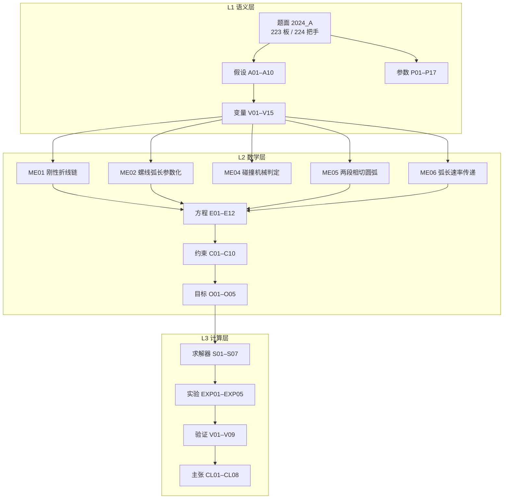

# 2024 CUMCM A「板凳龙」— 模型描述文档

> 项目：`projects/cumcm2024a-harness` ｜ 模型 ID：`M001` ｜ MODEL_IR：`model_ir.json`（v1.0，已通过 `model_ir.schema.json` 校验）
> Source of truth = Artifact Registry（`state/registry.json`）+ Evidence Graph（`state/evidence_graph.json`）
> 题面：`inputs/problem.txt` ｜ SHA256：`9baf81fb40f82f776998540524a6f2fe45f232af621343e9ae30e5dd97dbd53e`

---

## 问题结构识别

题面给的是**几何运动（geometric_motion / kinematic）**结构：对象是一串刚体（板凳）铰接成的链，
在给定曲线上做不可伸长的平面运动，全部问项都是这条链的**构型、速度、可行域与极值**问题。
（与 `research/P15/benchmark/problem_cards/2024_A/gt.json` 的 `allowed_modeling_structures` 一致：
`kinematics / pure_geometric_spiral / differential_geometry / numerical_optimization / multibody_dynamics`。）

**一句话模型**：把 223 节板凳抽象为 224 个把手构成的**刚性折线链**，约束其全部落在一条行进路径 Γ 上；
构型由龙头前把手的弧长坐标 σ₀ **唯一**确定，其余问项都是在这个构型映射上做的判定或优化。



---

## 建模的关键决断：弦长约束，不是弧长约束

同一条板凳是刚体，两孔（把手）中心距固定：

$$L_0 = 3.41 - 2\times 0.275 = 2.86\ \text{m},\qquad L_b = 2.20 - 2\times 0.275 = 1.65\ \text{m}$$

所以约束是

$$\boxed{\ |\Gamma(\sigma_{k+1}) - \Gamma(\sigma_k)| = L_k\ }$$

（**弦长**），而**不是**"相邻把手沿曲线弧长间距恒为 L"的常见近似。这个差别不是数值细节：

| 时点 | 龙尾（后）速率（本模型） | 弧长等分近似 |
|---|---|---|
| t = 300 s | **0.996478 m/s** | 恒 1.000000 |

链路不可伸长，但**弧长**间隔随局部曲率变化（δ ≈ L(1 + L²/24R²)），因此后方把手速率并不等于龙头速率。
该差异经 h = 1 / 0.5 / 0.25 s 三档中心差分确认收敛（0.99647754 → 0.99647753），是**真实物理**而非数值误差。

---

## 坐标系与几何判据

- **坐标系**：以螺线中心为**原点 O**；取初始时刻龙头（第 16 圈 A 点）的极角方向为 **x 轴**正向，
  **y 轴**由右手系确定。长度单位 m，时间单位 s，角度单位 rad；盘入方向为极角递减（顺时针）。
- **几何判据**（三判据，全部为机械可判定）：
  1. **弦长判据**：$|\Gamma(\sigma_{k+1})-\Gamma(\sigma_k)| = L_k$ —— 构型递推的唯一依据；
  2. **碰撞判据**：非相邻板体中心线距离 $< w = 0.30$ m —— Q2/Q3 的终止/可行条件（几何约束）；
  3. **相切判据**：调头曲线各段在接点处切向连续（C¹）—— Q4 的几何条件。
- **解析解（闭式）**：螺线弧长 $s(\theta)$ 有闭式；两段圆弧的位置/切向有闭式；
  调头参数由 $\tan(\psi/2)=-(D\cdot\mathbf n)/(D\cdot\mathbf u)$ 闭式给出；
  碰撞的线段距离取凸二次函数驻点，属精确解而非数值搜索。
- **时间步**：Q1 输出步长 1 s；Q2 定位用 0.05 s 细扫（时间步），速度用 h = 10⁻³ s 中心差分；
  Q5 峰值用 0.5 / 0.1 / 0.05 s 三档时间步确认收敛。

## 模型

### 路径 Γ（统一弧长参数化）

Q1–Q3 的 Γ 是等距螺线；Q4–Q5 是**入螺线 → 弧1 → 弧2 → 出螺线**的组合曲线。二者共享同一弧长坐标 σ，
因此 Q1–Q5 复用同一个递推器。

| 段 | 表达式 | 行进方向 |
|---|---|---|
| 等距螺线 | $r(\theta)=b\theta,\ b = p/2\pi$；$s(\theta)=\frac{b}{2}\left(\theta\sqrt{1+\theta^2}+\operatorname{arsinh}\theta\right)$ | θ 递减 = 顺时针向内；θ 递增 = 逆时针向外 |
| 圆弧 | $P(a)=P_0+\frac1k\big(\mathbf n - R(ka)\mathbf n\big),\ \mathbf T(a)=R(ka)\mathbf u$ | k>0 左转 |
| 盘出螺线 | $-P(\theta)$（关于中心的中心对称像） | θ 递增 |

> 关键恒等式：入螺线向内、出螺线向外的**行进切向同为** $\mathbf u(\theta)=-P'(\theta)/|P'(\theta)|$
> （入端 θ 递减取负号，出端点取负后 θ 递增，两个负号相消）。这是 Q4 一切解析结论的起点。

### 构型递推与速度

- **构型**：σ₀ → 向后逐个解 $\delta_k$（Newton，以上一连杆解为热启动；失败回退网格+二分）→ $\sigma_{k+1}=\sigma_k-\delta_k$。
  实测：223 连杆 × 301 帧耗时 4.7 s，弦长残差 ≤ 3.3e-13 m。
- **速度**：$\mathbf v_k = \dfrac{d\sigma_k}{d\sigma_0} v_{head}\,\mathbf T(\sigma_k)$，实现上直接中心差分（h = 10⁻³ s）。

### 碰撞判定（Q2/Q3）

板体是**含把手外 0.275 m 伸出**的矩形（长 3.41 / 2.20 m，宽 0.30 m）：

$$\mathbf a_j = P_j - e\,\mathbf u_j,\quad \mathbf b_j = P_{j+1} + e\,\mathbf u_j,\quad e = 0.275$$

$$d_{min}=\min_{|i-j|\ge 2}\ \mathrm{dist}\big([\mathbf a_i,\mathbf b_i],[\mathbf a_j,\mathbf b_j]\big) < w = 0.30\ \text{m}$$

线段距离取"内部驻点 + 4 条边钳制驻点"的最小者——对凸二次函数在矩形域上是**精确解**。
相邻板（共用把手铰接）不计碰撞（A06）；胶囊近似使判定**偏保守**（略早报碰撞，安全方向）。

---

## 各问结果与论证

| 问 | 量 | 结果 | 证据 |
|---|---|---|---|
| Q1 | 0–300 s 全队位置速度 | 67424 行；连杆残差 3.29e-13 m | `result1.xlsx` |
| Q1 | 速率差于龙头的最大偏差 | 0.003522 m/s | `result1.xlsx` |
| **Q2** | **盘入终止时刻 t\*** | **397.7836 s**（临界板距 0.300000 m，临界板对 = 龙头板 / 第 10 条板） | `result2.xlsx` |
| **Q3** | **最小螺距** | **0.444260 m = 44.426 cm** | `result3.xlsx` |
| **Q4** | **R₁, R₂, ψ, L** | **3.005418 m, 1.502709 m, 173.118°, 13.621245 m** | `result4.xlsx` |
| **Q5** | **龙头最大速度** | **1.247011 m/s** | `result5.xlsx` |

### Q2：最小板距是**非单调振荡**的

链是内接于螺线的**离散多边形**，板体相对相位周期性变化，振幅 ≈ 板长²/(8r)：

```text
t        minD      临界板对
380      0.33447   (0,12)
390      0.31517   (0,11)
396      0.32632   (0,13)   ← 非单调！
397.75   0.300346  —
397.80   0.299836  —        ← 首次 < 0.30
420      0.21524   (0,7)
432      0.09462   (0,4)
```

因此**不能**假定单调后二分，必须 1 s 粗扫 + 0.05 s 细扫定位。
连续性校验：细扫相邻帧龙头位移恰为 0.05000 m = v·Δt，排除求根跳支。

### Q3：结论与"从多远开始盘入"无关

整链构型只由 (螺距, 龙头弧长) 决定，**与盘入历史无关**；越往内曲率越大 ⇒ 最危险构型必在龙头半径最小处 r = 4.5 m。
扫描验证（p = p_min 时的最小板距）：

| 龙头半径 (m) | 4.5 | 5 | 6 | 8 | 11 | 15 | 20 |
|---|---|---|---|---|---|---|---|
| 最小板距 (m) | **0.300001** | 0.329322 | 0.328381 | 0.350480 | 0.384804 | 0.403535 | 0.412262 |

### Q4：调头曲线长度是**不变量** —— 不能靠调半径缩短

两端切向相同 ⇒ ψ₁ = ψ₂ = ψ，两段位移合并后：

$$D = B - A = (R_1+R_2)\big(\sin\psi\,\mathbf u - (1-\cos\psi)\,\mathbf n\big)
\;\Rightarrow\; \tan\frac\psi2 = -\frac{D\cdot\mathbf n}{D\cdot\mathbf u},\quad R_1+R_2=\frac{D\cdot\mathbf u}{\sin\psi}$$

ψ 与 **半径和** 被端点唯一确定，故 $L=(R_1+R_2)\psi$ 与半径**分配无关**。数值验证：

| R₁:R₂ | 1:1 | 1.5:1 | **2:1** | 3:1 | 5:1 | 10:1 |
|---|---|---|---|---|---|---|
| R₁ (m) | 2.254063 | 2.704876 | **3.005418** | 3.381095 | 3.756772 | 4.098297 |
| R₂ (m) | 2.254063 | 1.803251 | **1.502709** | 1.127032 | 0.751354 | 0.409830 |
| L (m) | 13.621245 | 13.621245 | **13.621245** | 13.621245 | 13.621245 | 13.621245 |

**答：不能。** 若进一步允许出螺线切点 B 沿螺线内移，S 曲线形式上的确可以更短（3.18 m），
但第二段弧半径退化到 ~10³ m（即**直线**，已非 S 形），且把出螺线在圆内的那一段计入后，
圆内完整调头路径由 **13.62 m 增至 ≥ 18.70 m** —— 不构成真正的缩短。

曲线几何自检：半径范围 [1.494611, 4.500000] m ⊂ 调头空间；端点闭合误差 8.0e-15 m；
接点 J = (0.903952, 1.197026)，|J| = 1.500 m。

### Q5：不需对速度做搜索

速率比 $r_k=|d\sigma_k/d\sigma_0|$ **只依赖龙头位置**，与 v_head 无关 ⇒ 约束关于 v_head 线性：

$$v_{head}^{max}=\frac{2}{\max_{k,t} r_k}=\frac{2}{1.603835}=1.247011\ \text{m/s}$$

峰值出现在 **t = 14.50 s、第 3 号把手**——即龙头刚驶出调头曲线（L = 13.62 m）约 0.9 m、
而其后方把手仍在 R₂ = 1.50 m 小弧上时。峰值尖锐：1 s 网格会漏（只看到 1.42），
0.5 / 0.1 / 0.05 s 三档均给出 1.603835，收敛确认。

---

## 验证矩阵

| ID | 类型 | 方法 | 结果 |
|---|---|---|---|
| V01 | convergence | 223 连杆 × 全时间步弦长残差 | ≤ 3.3e-13 m（Q1）/ 2.9e-13 m（Q4） |
| V02 | convergence | 调头曲线端点闭合 + 调头空间包含性 | 8.0e-15 m；r ∈ [1.4946, 4.5] ✓ |
| V03 | baseline | 与独立实现交叉比对 t=300 s 龙尾速率 | 0.99647745 vs 0.996478（6 位一致） |
| V04 | robustness | 速度差分 h = 1/0.5/0.25 s | 收敛，证明速率差是真实物理 |
| V05 | counterfactual | 6 种半径分配重算 L | 恒为 13.621245 m |
| V06 | sensitivity | 切点 B 沿出螺线滑动 | S 更短但圆内总长 13.62 → ≥18.70 m |
| V07 | convergence | Q5 峰值网格 0.5/0.1/0.05 s | 一致 1.603835 |
| V08 | failure_case | R₂ = 1.5027 m vs R_min = 1.43 m | 裕度 0.073 m（刚性能跟随性硬约束） |
| V09 | robustness | 细扫相邻帧位移 = v·Δt | 0.05000 m ✓ 无求根跳支 |

---

## 局限（如实声明）

1. **A04（外推假设）**：题面只在问题 1 明示"各把手均位于螺线上"。Q2–Q5 沿用该假定到组合曲线；
   严格建模需要拖曳链的刚体-铰链动力学，题面未给摩擦/驱动信息。影响量级 ≤ 板宽，位于调头段。
2. **A05（保守近似）**：碰撞用胶囊近似矩形，判定偏早（保守方向）。
3. **A10（硬约束）**：R₂ = 1.5027 m 距刚性链可跟随下限 1.43 m 仅 0.073 m，是本题几何的紧约束点。
4. **未做官方答案比对**：`gt.json` 的 `reference_results` 为空，按仓库铁律不凭记忆伪造 GT。
5. **Q3 的网格**：龙头半径扫描取 7 点（4.5–20 m），非连续扫描；结论依赖"构型-历史无关性 + 单调性"。

---

## 复现

```bash
cd projects/cumcm2024a-harness/artifacts/code
py -3.12 -m q1_solve        # → result1.xlsx  (~35 s)
py -3.12 -m q2_solve        # → result2.xlsx  (~85 s)
py -3.12 -m q3_solve        # → result3.xlsx  (~7 min，螺距二分)
py -3.12 -m q4_solve        # → result4.xlsx  (~40 s)
py -3.12 -m q5_solve        # → result5.xlsx  (~85 s)
py -3.12 -m build_model_ir  # → model_ir.json + jsonschema 校验
py -3.12 -m init_state      # → state/{registry,evidence_graph,decision_log,status}.json
py -3.12 -m export_all_results  # → 项目根结果聚合文件（数值追溯真源）
```

全部为确定性几何/求根计算，**无随机性**，故不涉及随机种子与多种子重跑。
核心库：`dragon_core`（路径原语 / 刚性链递推 / 碰撞）、`turnaround`（调头曲线解析与最短化）。
