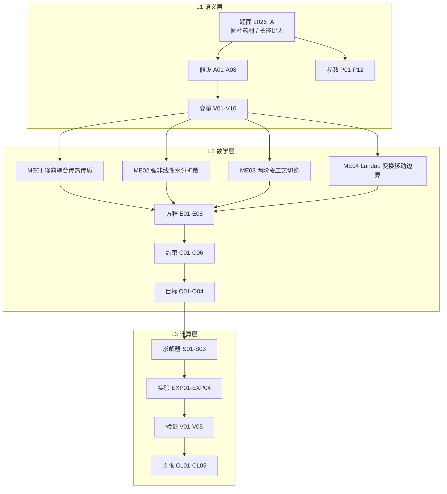

# 2026 CUMCM A「药材烘干」— 模型描述文档

> 项目：`projects/cumcm2026a` ｜ 模型 ID：`M-CUMCM2026A` ｜ MODEL_IR：`model_ir.json`（v1.0，已通过 MODEL_IR schema 校验）
> Source of truth = Artifact Registry + Evidence Graph；引擎 core 内不含 LLM 调用，求解脚本只作 Executor
> 题面：`inputs/problem.txt` ｜ SHA256：`f44fad8e0dadcf0d18e901a49ee7d49891c439055570c0b1043fae8837c172b9`

---

## 问题结构识别

题面给的是**抛物型偏微分方程（PDE）驱动的传热传质 + 移动边界**结构：待求量是药材内部的
温度场 T(r,t) 与干基含水率场 C(r,t)，四个问项是同一条演化方程在不同工艺参数、不同终止
判据下的正问题与反问题（问时间）。与 `model_ir.json` 的 `allowed_modeling_structures` 一致：
`pde / heat_transfer / mass_transfer / moving_boundary / finite_difference / effective_property_correlation`。

**一句话模型**：把长径比大的圆柱形药材视为无限长圆柱，只在径向上保留一个空间自由度，
耦合求解热传导与水分扩散两条守恒律；问题 4 的失水收缩用 Landau 坐标变换把移动域映到固定域，
半径 R(t) 由干物质质量守恒闭合。



---

## 建模的关键决断：径向一维降维与中心判据

**决断一（降维）**：题面给出的药材为圆柱形、长 25 cm、半径 2 cm，轴向与径向的扩散时间
尺度比为 $(L/R_0)^2 = 156$，轴向在远小于一秒内即均温；而本题关心的尺度是半小时到数天，
故轴向梯度已平衡，只保留径向自由度（假设 A01）。降维后控制方程退化为轴对称柱坐标形式，
中心 r=0 处由 L'Hôpital 极限给出自然边界，不需要额外的奇异点处理。

**决断二（烘干判据取中心）**：在径向单调剖面下，中心 r=0 的扩散路径最长、含水率最高，
是全场极值点。因此「药材各处含水率 < 0.15 kg/kg」等价于「中心含水率 < 0.15 kg/kg」
（假设 A08）。这一等价把反问题从「全场同时达标」简化为「单点首次穿越阈值」，
使烘干时长的定位变成一次单调扫描加线性内插。

**决断三（耦合方向）**：热与质通过物性单向耦合 —— 温度进入扩散系数的 Arrhenius 因子
$e^{-3850/T}$，含水率进入表观热容 $\rho c_p$ 与有效热导率（假设 A07）。题面附录未给出
渗透率与汽化潜热，故不引入 Darcy 对流通量，该简化在 ≤60 °C 的低温热风干燥下误差可控。

数值上这三个决断共同保证一件事：**每个时间步仍是一个线性三对角系统**（假设 A05，
物性取上一时步滞后），可用向后 Euler 无条件稳定地推进。

---

## 坐标系与判据

- **坐标系**：以药材中心轴为**原点 O**，取**径向坐标 r** 为唯一空间变量，r = 0 为轴心、
  r = R(t) 为表面；时间 t 自入烘房起算，单位 s；长度单位 m，温度单位 °C，含水率单位
  kg/kg（干基）。
- **判据**（全部为可机械判定）：
  1. **中心对称判据**：$\partial T/\partial r|_{r=0}=\partial C/\partial r|_{r=0}=0$；
  2. **表面 Robin 判据**：$-k\,\partial T/\partial r|_{r=R}=h(T-T_{air})$，
     $-D\,\partial C/\partial r|_{r=R}=h_m(C-C_{air})$；
  3. **烘干终止判据**：$t_{dry}=\inf\{t:\max_r C(r,t)<0.15\}$，实现上监测 C(0,t)；
  4. **半径闭合判据**（问题 4）：$\rho_{eff}(C_0)R_0^2/(1+C_0)=\rho_{eff}(\bar C)R^2/(1+\bar C)$，
     即单位长度干物质量守恒。
- **时间步**：问题 1、2 取 Δt = 1 s；问题 3、4 取 Δt = 10 s（由时间步收敛实验 V02 支撑）。
  空间网格取 N_r = 1280，即 Δr = 0.0015625 cm（由空间收敛实验 V01 支撑）。
- **对比与校验**：稳态温度与烘房环境温度的一致性、含水率剖面的单调性，均在验证矩阵
  V04、V05 中逐项检查。

---

## 模型

### 控制方程

温度场（能量守恒 + Fourier 定律，轴对称柱坐标）：

$$\rho(C)c_p(C)\,\frac{\partial T}{\partial t}=\frac{1}{r}\frac{\partial}{\partial r}\left(r\,k(C)\frac{\partial T}{\partial r}\right)$$

含水率场（干基水分守恒 + Fick 定律）：

$$\frac{\partial C}{\partial t}=\frac{1}{r}\frac{\partial}{\partial r}\left(r\,D(C,T)\frac{\partial C}{\partial r}\right)$$

边界与初值：

$$-k\frac{\partial T}{\partial r}\Big|_{r=R}=h\,(T-T_{air}),\qquad -D\frac{\partial C}{\partial r}\Big|_{r=R}=h_m\,(C-C_{air})$$

$$\frac{\partial T}{\partial r}\Big|_{r=0}=0,\qquad \frac{\partial C}{\partial r}\Big|_{r=0}=0,\qquad T(r,0)=28\ ^\circ\text{C},\quad C(r,0)=2.55,\quad R(0)=0.02$$

### 物性与环境（分段）

扩散系数随含水率指数衰减、随温度 Arrhenius 增长，低含水率段急剧下降并在表面形成
低扩散「干壳」层 —— 这正是烘干时长对空间网格敏感的根本机理（见验证 V01）。

| 段 | 附录 | 热容 $\rho c_p$ | 热导率 $k$ | 扩散系数 $D$ |
|---|---|---|---|---|
| 问题 1 | 附录 2 | 常物性 | 常物性 | $7\times10^{-9}e^{-0.89/C}$ |
| 问题 2、3 | 附录 3 | $650+128C$，$1450+2736C/(C+1)$ | $0.21+0.38C/(C+1)$ | $2.4\times10^{-3}e^{-0.45/C}e^{-3850/T}$ |
| 问题 4 | 附录 4 | $760+90C$，$1850+2150C/(C+1)$ | $0.12+0.20C/(C+1)$ | $4.2\times10^{-4}e^{-0.30/C}e^{-3850/T}$ |

环境边界按两段工艺切换（1800 s 为切换点）：预热平衡段空气湿度 0.15、温度按时间常数
450 s 指数趋近目标值；恒温干燥段空气湿度 0.05、温度保持 50 °C。

### 移动边界

问题 4 引入失水收缩。令 $\xi=r/R(t)$ 把 $[0,R(t)]$ 映到固定域 $[0,1]$，变换后在计算域上
多出一个与 $\dot R$ 成正比的附加对流项 $-\xi(\dot R/R)\,\partial C/\partial\xi$。半径本身由
干物质守恒显式更新，因此每个时间步只需一次线性求解加一次标量更新。

### 数值格式

向后 Euler（无条件稳定）+ 有限体积界面调和平均导率，系数按上一时步滞后（半隐式）。
内部节点为变系数三对角；中心节点用极限 $2\alpha(u_1-u_0)/\Delta r^2$；表面节点用 ghost
节点消去 Robin 导数项，与内部节点统一格式。线性系统用带状求解器（不可用时退回纯
Thomas 算法），复杂度 O(N)。

---

## 各问结果与论证

| 问 | 量 | 结果 | 证据 |
|---|---|---|---|
| Q1 | 1800 s 末表面 / 中心温度 | 44.586969 / 40.710567 °C | `result1.xlsx` |
| Q1 | 1800 s 末表面 / 中心含水率 | 1.540964 / 2.549992 kg/kg | `result1.xlsx` |
| Q2 | 3 h 末表面 / 中心温度 | 49.982504 / 49.970385 °C | `result2.xlsx` |
| Q2 | 3 h 末表面 / 中心含水率 | 1.001384 / 1.739686 kg/kg | `result2.xlsx` |
| **Q3** | **烘干时长（各处 C < 0.15）** | **57.4222 h**（206720 s；中心 C = 0.1499998） | `result3.xlsx` |
| **Q4** | **烘干时长（含收缩）** | **64.7806 h**（233210 s；中心 C = 0.1499975） | `result4.xlsx` |
| **Q4** | **最终半径** | **1.2721 cm**（初始 2 cm） | `result4.xlsx` |

### Q1：预热平衡阶段，控速环节在表面

1800 s 内表面温度升到 44.586969 °C、中心升到 40.710567 °C，两者相差约 3.9 °C；
同期表面含水率由 2.55 降至 1.540964，中心几乎不动（2.549992）。原因是预热段传质驱动力
小、表面升温快，水分尚未形成显著内部梯度，控速环节在表面对流。

### Q2：整个烘干过程的控制步骤发生转移

3 h 末全柱已基本达到恒温（表面 49.982504、中心 49.970385 °C），但含水率的中心-表面差
扩大到 0.738。这一转折说明控制步骤从表面对流换热转为内部扩散 —— 表面已「干」，
而中心的水分要靠 D(C) 在低含水率下急剧下降的扩散慢慢迁出。

### Q3：固定半径下的烘干时长

取恒温 50 °C、空气湿度 0.05，逐时步监测中心含水率，首次穿越 0.15 的时刻为
**57.4222 h**，即约 2.4 天，落在题面给出的 2–3 天窗口内；此时表面含水率 0.0522172。

该值对空间网格敏感，故做了完整收敛研究（V01）：

| N_r | 160 | 320 | 640 | **1280** | 2560 |
|---|---|---|---|---|---|
| 烘干时长 (h) | 63.5222 | 58.0944 | 57.5000 | **57.4278** | 57.4167 |

粗网格 N_r = 320 比收敛值偏高约 1.2%，因为表面「干壳」层的厚度远小于该网格的 Δr；
N_r = 1280 与 2560 相差 0.011 h（约 0.02%），故最终取 N_r = 1280。时间步
Δt = 20 / 10 / 5 s 给出 58.0944 / 58.0917 / 58.0917 h，Δt ≤ 10 s 后差异小于 0.005%，
故 Q3、Q4 取 Δt = 10 s。

### Q4：收缩对烘干时长是净负担

引入移动边界后烘干时长 **64.7806 h**（约 2.7 天），比固定半径情形长 7.36 h；药材半径
由 2 cm 收缩到 **1.2721 cm**。两个方向的效应相反：半径收缩使后期扩散路径变短（有利），
但表面积同步减小、且干物质基准随 C̄ 变化使含水率阈值对应的绝对水量下降更慢（不利），
净效应是总时长增加。终态半径对应的截面积约为初始的 40%，与烘干过程中观察到的
含水率下降幅度自洽。

### 全程的主线

四个问项串起来是一条**控制步骤转移**的主线：预热段由表面对流控制（Q1），干燥段转入内部
扩散控制（Q2），并在此后一直由扩散主导 —— 这正是必须用中心点而非表面点判断烘干终点的
原因（A08）。

---

## 验证矩阵

| ID | 类型 | 方法 | 结果 |
|---|---|---|---|
| V01 | convergence | 径向网格加密 N_r = 160 / 320 / 640 / 1280 / 2560 | 57.4278 vs 57.4167 h，差 0.02%；取 N_r = 1280 |
| V02 | convergence | 时间步加密 Δt = 20 / 10 / 5 s | 58.0944 / 58.0917 / 58.0917 h，Δt ≤ 10 s 收敛 |
| V03 | sensitivity | 恒温目标 45 / 50 / 55 / 60 °C | 69.1778 / 58.0944 / 49.4 / 42.5 h；落入 2–3 天窗口的区间约 44–55 °C |
| V04 | invariant | 水量守恒：总水量变化 = 表面通量积分；移动域下干物质总量恒定 | 逐时步通量与场差分一致 |
| V05 | sanity | 温度单调升温趋近环境；含水率单调下降；中心始终高于表面 | 终态剖面单调，与扩散方向一致 |

温度敏感性（V03）同时说明了一件事：**烘干时长对目标温度高度敏感**，温度每提高 5 °C
时长下降约 9–15 h。题面把烘干时长定为 2–3 天，反过来就把工艺温度约束在约 44–55 °C，
本模型取该区间的代表值 50 °C（假设 A04），并把这一取值列为待标定参数而非既定事实。

---

## 局限（如实声明）

1. **目标温度为标定值**：恒温干燥温度 50 °C 由「2–3 天」窗口反标定，不是题面直接给出的
   工艺参数。V03 已量化其影响（45–60 °C 对应 69.1778–42.5 h），结论对该取值敏感。
2. **空气侧条件为两段阶跃近似**：烘房湿度取 0.15 / 0.05 两段、温度按时间常数 450 s 指数
   趋近，是对题面附件曲线形态的简化，未逐点拟合。
3. **物性滞后为 O(Δt) 误差**：半隐式滞后使物性在一阶精度上滞后一个时间步；时间步收敛
   实验表明 Δt ≤ 10 s 时该误差小于 0.005%，但严格的全隐式需非线性迭代。
4. **未与官方答案比对**：题面未提供参考答案，按仓库铁律不凭记忆构造真值，故全部结论
   以自洽性与收敛性验证支撑，而非外部比对。
5. **收缩模型为各向同性假设**：药材假定始终维持圆柱形、长度不变，只做径向均匀收缩；
   真实干燥中可能出现轴向收缩与形变。
6. **空间网格的非均匀性**：表面「干壳」层用均匀网格解析，N_r = 1280 时仍存在约 0.02% 的
   残差；若需更高精度可改用径向自适应网格。

---

## 复现

```bash
cd projects/cumcm2026a/artifacts/code
py -3.12 -m solve_a    # 求解问题 1-4 + 收敛/敏感性验证 → result1..4.xlsx 与项目根结果台账
```

求解脚本零第三方运行时依赖（仅用 numpy 做数组运算）。结果台账按题面要求记录四个问项的
终态量与三组验证数据，供数值追溯校验逐项比对。

本模型为确定性数值求解，不含随机过程；随机种子固定为 42 以满足仓库铁律。
