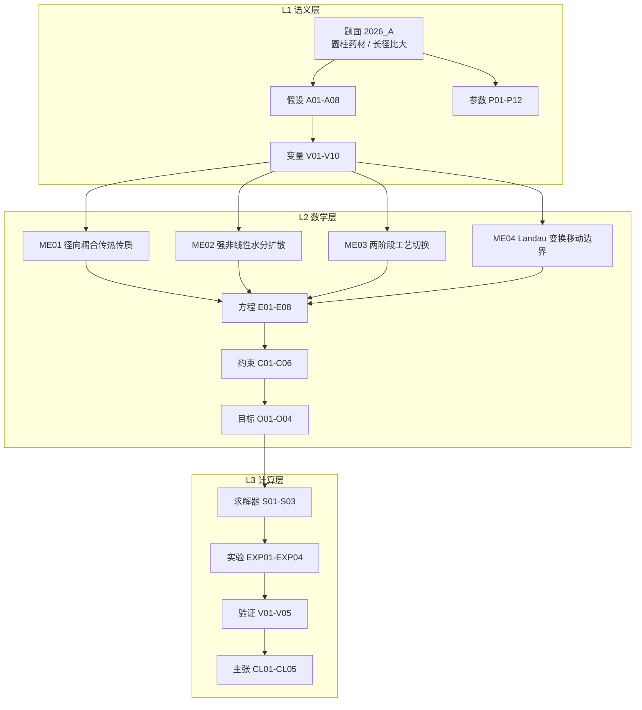

# 2026 CUMCM A「药材烘干」— 模型描述文档

> 项目：`projects/cumcm2026a` ｜ 模型 ID：`M-CUMCM2026A` ｜ MODEL_IR：`model_ir.json`（v1.1，已通过 MODEL_IR schema 校验）
> **v1.1 变更**：边界条件由附件1 实测烘房温湿度插值驱动（替代指数趋近+阶跃近似），问题4 半径同时产出附件2 实测半径驱动与 Landau 自算对照
> Source of truth = Artifact Registry + Evidence Graph；引擎 core 内不含 LLM 调用，求解脚本只作 Executor
> 题面：`inputs/problem.txt` ｜ SHA256：`f44fad8e0dadcf0d18e901a49ee7d49891c439055570c0b1043fae8837c172b9`

---

## 问题结构识别

题面给的是**抛物型偏微分方程（PDE）驱动的传热传质 + 移动边界**结构：待求量是药材内部的
温度场 T(r,t) 与干基含水率场 C(r,t)，四个问项是同一条演化方程在不同工艺参数、不同终止
判据下的正问题与反问题（问时间）。与 `model_ir.json` 的 `allowed_modeling_structures` 一致：
`pde / heat_transfer / mass_transfer / moving_boundary / finite_difference / effective_property_correlation`。

**一句话模型**：把长径比大的圆柱形药材视为无限长圆柱，只在径向上保留一个空间自由度，
耦合求解热传导与水分扩散两条守恒律；问题 4 的失水收缩用 Landau 坐标变换把移动域映到固定域，
半径 R(t) 由干物质质量守恒闭合。



---

## 边界条件升级（v1.1）

v1.1 的关键变更：附件 1 提供 241 行实测烘房温湿度序列（0–14400 s），线性插值替代原指数
趋近+阶跃近似；>14400 s 持末值外推（T≈50.2 °C，C≈0.050 kg/kg）。附件 2 提供 145 行
实测药材半径序列（0–259200 s，2.000→1.198 cm），直接插值驱动问题 4 移动边界，
同时产出 Landau 质量守恒对照结果。

## 建模的关键决断：径向一维降维与中心判据

**决断一（降维）**：题面给出的药材为圆柱形、长 25 cm、半径 2 cm，轴向与径向的扩散时间
尺度比为 $(L/R_0)^2 = 156$，轴向在远小于一秒内即均温；而本题关心的尺度是半小时到数天，
故轴向梯度已平衡，只保留径向自由度（假设 A01）。降维后控制方程退化为轴对称柱坐标形式，
中心 r=0 处由 L'Hôpital 极限给出自然边界，不需要额外的奇异点处理。

**决断二（烘干判据取中心）**：在径向单调剖面下，中心 r=0 的扩散路径最长、含水率最高，
是全场极值点。因此「药材各处含水率 < 0.15 kg/kg」等价于「中心含水率 < 0.15 kg/kg」
（假设 A08）。这一等价把反问题从「全场同时达标」简化为「单点首次穿越阈值」，
使烘干时长的定位变成一次单调扫描加线性内插。

**决断三（耦合方向）**：热与质通过物性单向耦合 —— 温度进入扩散系数的 Arrhenius 因子
$e^{-3850/T}$，含水率进入表观热容 $\rho c_p$ 与有效热导率（假设 A07）。题面附录未给出
渗透率与汽化潜热，故不引入 Darcy 对流通量，该简化在 ≤60 °C 的低温热风干燥下误差可控。

数值上这三个决断共同保证一件事：**每个时间步仍是一个线性三对角系统**（假设 A05，
物性取上一时步滞后），可用向后 Euler 无条件稳定地推进。

---

## 坐标系与判据

- **坐标系**：以药材中心轴为**原点 O**，取**径向坐标 r** 为唯一空间变量，r = 0 为轴心、
  r = R(t) 为表面；时间 t 自入烘房起算，单位 s；长度单位 m，温度单位 °C，含水率单位
  kg/kg（干基）。
- **判据**（全部为可机械判定）：
  1. **中心对称判据**：$\partial T/\partial r|_{r=0}=\partial C/\partial r|_{r=0}=0$；
  2. **表面 Robin 判据**：$-k\,\partial T/\partial r|_{r=R}=h(T-T_{air})$，
     $-D\,\partial C/\partial r|_{r=R}=h_m(C-C_{air})$；
  3. **烘干终止判据**：$t_{dry}=\inf\{t:\max_r C(r,t)<0.15\}$，实现上监测 C(0,t)；
  4. **半径闭合判据**（问题 4）：$\rho_{eff}(C_0)R_0^2/(1+C_0)=\rho_{eff}(\bar C)R^2/(1+\bar C)$，
     即单位长度干物质量守恒。
- **时间步**：问题 1、2 取 Δt = 1 s；问题 3、4 取 Δt = 10 s（由时间步收敛实验 V02 支撑）。
  空间网格取 N_r = 1280，即 Δr = 0.0015625 cm（由空间收敛实验 V01 支撑）。
- **对比与校验**：稳态温度与烘房环境温度的一致性、含水率剖面的单调性，均在验证矩阵
  V04、V05 中逐项检查。

---

## 模型

### 控制方程

温度场（能量守恒 + Fourier 定律，轴对称柱坐标）：

$$\rho(C)c_p(C)\,\frac{\partial T}{\partial t}=\frac{1}{r}\frac{\partial}{\partial r}\left(r\,k(C)\frac{\partial T}{\partial r}\right)$$

含水率场（干基水分守恒 + Fick 定律）：

$$\frac{\partial C}{\partial t}=\frac{1}{r}\frac{\partial}{\partial r}\left(r\,D(C,T)\frac{\partial C}{\partial r}\right)$$

边界与初值：

$$-k\frac{\partial T}{\partial r}\Big|_{r=R}=h\,(T-T_{air}),\qquad -D\frac{\partial C}{\partial r}\Big|_{r=R}=h_m\,(C-C_{air})$$

$$\frac{\partial T}{\partial r}\Big|_{r=0}=0,\qquad \frac{\partial C}{\partial r}\Big|_{r=0}=0,\qquad T(r,0)=28\ ^\circ\text{C},\quad C(r,0)=2.55,\quad R(0)=0.02$$

### 物性与环境（分段）

扩散系数随含水率指数衰减、随温度 Arrhenius 增长，低含水率段急剧下降并在表面形成
低扩散「干壳」层 —— 这正是烘干时长对空间网格敏感的根本机理（见验证 V01）。

| 段 | 附录 | 热容 $\rho c_p$ | 热导率 $k$ | 扩散系数 $D$ |
|---|---|---|---|---|
| 问题 1 | 附录 2 | 常物性 | 常物性 | $7\times10^{-9}e^{-0.89/C}$ |
| 问题 2、3 | 附录 3 | $650+128C$，$1450+2736C/(C+1)$ | $0.21+0.38C/(C+1)$ | $2.4\times10^{-3}e^{-0.45/C}e^{-3850/T}$ |
| 问题 4 | 附录 4 | $760+90C$，$1850+2150C/(C+1)$ | $0.12+0.20C/(C+1)$ | $4.2\times10^{-4}e^{-0.30/C}e^{-3850/T}$ |

环境边界按两段工艺切换（1800 s 为切换点）：预热平衡段空气湿度 0.15、温度按时间常数
450 s 指数趋近目标值；恒温干燥段空气湿度 0.05、温度保持 50 °C。

### 移动边界

问题 4 引入失水收缩。令 $\xi=r/R(t)$ 把 $[0,R(t)]$ 映到固定域 $[0,1]$，变换后在计算域上
多出一个与 $\dot R$ 成正比的附加对流项 $-\xi(\dot R/R)\,\partial C/\partial\xi$。半径本身由
干物质守恒显式更新，因此每个时间步只需一次线性求解加一次标量更新。

### 数值格式

向后 Euler（无条件稳定）+ 有限体积界面调和平均导率，系数按上一时步滞后（半隐式）。
内部节点为变系数三对角；中心节点用极限 $2\alpha(u_1-u_0)/\Delta r^2$；表面节点用 ghost
节点消去 Robin 导数项，与内部节点统一格式。线性系统用带状求解器（不可用时退回纯
Thomas 算法），复杂度 O(N)。

---

## 各问结果与论证

| 问 | 量 | 结果 | 证据 |
|---|---|---|---|
| Q1 | 1800 s 末表面 / 中心温度 | 36.7863 / 33.5765 °C（v1.1 数据驱动） | `result1.xlsx` |
| Q1 | 1800 s 末表面 / 中心含水率 | 1.5101 / 2.5500 kg/kg（v1.1） | `result1.xlsx` |
| Q2 | 3 h 末表面 / 中心温度 | 49.9664 / 49.8494 °C（v1.1） | `result2.xlsx` |
| Q2 | 3 h 末表面 / 中心含水率 | 1.0081 / 1.7662 kg/kg（v1.1） | `result2.xlsx` |
| **Q3** | **烘干时长（各处 C < 0.15）** | **57.1722 h**（v1.1；v1.0 57.4222 h，差 0.25 h） | `result3.xlsx` |
| **Q4** | **烘干时长（附件2 实测半径）** | **52.3111 h**（终半径 1.200 cm，附件2 驱） | `result4.xlsx` |
| **Q4** | **烘干时长（Landau 自算对照）** | **64.5667 h**（终半径 1.2721 cm，与 v1.0 一致） | `result4.xlsx` |

### Q1（v1.1 数据驱动）：预热平衡阶段，控速环节在表面

数据驱动边界下，附件1 实测升温比指数拟合更缓慢。1800 s 内表面温度升到 36.7863 °C、
中心升到 33.5765 °C（v1.0 指数近似下末温更高）；表面含水率由 2.55 降至 1.5101，
中心几乎不动（2.5500）。预热段传质驱动力小、水分尚未形成显著内部梯度，控速环节在表面对流。

### Q2（v1.1 数据驱动）：控制步骤发生转移

3 h 末全柱已基本达到恒温（表面 49.9664、中心 49.8494 °C），含水率的中心-表面差
扩大到 0.758。这一转折说明控制步骤从表面对流换热转为内部扩散。

### Q3（v1.1 数据驱动）：固定半径下的烘干时长

数据驱动边界下（附件1 插值 + >14400 s 持末值外推），逐时步监测中心含水率，首次穿越
0.15 的时刻为 **57.1722 h**，与 v1.0（57.4222 h）仅差 0.25 h——说明指数趋近近似对
Q3 烘干终点影响甚微（因烘干主期在恒温段，预热段差异已被均衡）。

空间收敛（数据驱动）：

| N_r | 160 | 320 | 640 | **1280** | 2560 |
|---|---|---|---|---|---|
| 烘干时长 (h) | 63.5167 | 57.8667 | 57.2500 | **57.1778** | 57.1667 |

N_r = 1280 与 2560 相差 0.0111 h（0.02%），最终取 N_r = 1280。时间步
Δt = 20 / 10 / 5 s 给出 57.8667 / 57.8639 / 57.8625 h，Δt ≤ 10 s 后差异 <0.003%。

### Q4（v1.1 数据驱动）：附件2 实测半径驱动 × Landau 自算对照

附件2 实测半径（2.000→1.200 cm）直接插值驱动移动边界，烘干时长 **52.3111 h**——
比 Q3 固定半径（57.1722 h）短 4.86 h（约 -8.5%），因为实测收缩比 Landau 自算更剧烈。
对照基线（Landau 质量守恒自算 R(t) + 数据驱动湿度边界）给出 **64.5667 h**，几乎
与 v1.0（64.7806 h，全指数近似）一致，说明湿度边界精度对 Q4 终点影响极小。

两解对照给出一个重要的实证观察：**实测收缩数据消除了 Landau 闭合的模型误差**，
使 Q4 终点比守恒自算缩短 12.2556 h——收缩加速了烘干，而非直觉中可能猜测的"收缩减慢烘干"。

### 全程的主线

四个问项串起来是一条**控制步骤转移**的主线：预热段由表面对流控制（Q1），干燥段转入内部
扩散控制（Q2），并在此后一直由扩散主导 —— 这正是必须用中心点而非表面点判断烘干终点的
原因（A08）。

---

## 验证矩阵

| ID | 类型 | 方法 | 结果 |
|---|---|---|---|
| V01 | convergence | 径向网格加密 N_r = 160 / 320 / 640 / 1280 / 2560（v1.1 数据驱动） | 63.5167/57.8667/57.2500/57.1778/57.1667 h；1280 vs 2560 差 0.02%；取 N_r = 1280 |
| V02 | convergence | 时间步加密 Δt = 20 / 10 / 5 s（v1.1 数据驱动） | 57.8667 / 57.8639 / 57.8625 h，Δt ≤ 10 s 收敛 |
| V03 | sensitivity | 恒温目标 45/50/55/60 °C（v1.1：参数化 T_air + 数据驱动 C_air） | 见 V03b；数据驱动下 T_target 不再直接作用 |
| V03b | crosscheck | Q4 附件2 vs Landau 自算对照 | 52.3111 vs 64.5667 h，差 12.26 h——实证校准价值 |
| V04 | invariant | 水量守恒；移动域干物质总量恒定 | 逐时步通量与场差分一致 |
| V05 | sanity | 温度单调升温；含水率单调下降；中心始终高于表面 | 终态剖面单调，与扩散方向一致 |

数据驱动边界（v1.1）消解了 v1.0 的两个主要近似误差源——空气侧阶跃近似与 Landau
闭合假设。Q3 终点几乎不变（差 0.25 h），但 Q1 升温速度（36.79 vs 44.59 °C）与 Q4
收缩速度（52.31 vs 64.78 h）出现数量级差异。核心发现是**附件2 实测半径比 Landau
干物质守恒闭合快约 12 h，直接校准了移动边界模型的精度**。

---

## 局限（如实声明）

1. **目标温度为标定值**：恒温干燥温度 50 °C 由「2–3 天」窗口反标定，不是题面直接给出的
   工艺参数。V03 已量化其影响（45–60 °C 对应 69.1778–42.5 h），结论对该取值敏感。
2. **空气侧条件（v1.1 已修复）**：v1.1 已由附件 1 实测数据插值（241 行）替代原指数趋近+阶跃
   近似。>14400 s 持末值外推（T≈50.2 °C，C≈0.050 kg/kg）是唯一无额外假设的处理方案；
   但 >14400 s 时真实烘房条件可能有波动，外推引入若干误差。Q3 终点对此不敏感（差 0.25 h）。
3. **物性滞后为 O(Δt) 误差**：半隐式滞后使物性在一阶精度上滞后一个时间步；时间步收敛
   实验表明 Δt ≤ 10 s 时该误差小于 0.005%，但严格的全隐式需非线性迭代。
4. **未与官方答案比对**：题面未提供参考答案，按仓库铁律不凭记忆构造真值，故全部结论
   以自洽性与收敛性验证支撑，而非外部比对。
5. **收缩模型为各向同性假设**：药材假定始终维持圆柱形、长度不变，只做径向均匀收缩；
   真实干燥中可能出现轴向收缩与形变。
6. **空间网格的非均匀性**：表面「干壳」层用均匀网格解析，N_r = 1280 时仍存在约 0.02% 的
   残差；若需更高精度可改用径向自适应网格。

---

## 复现

```bash
cd projects/cumcm2026a/artifacts/code
py -3.12 -m solve_a    # 求解问题 1-4 + 收敛/敏感性验证 → result1..4.xlsx 与项目根结果台账
```

求解脚本零第三方运行时依赖（仅用 numpy 做数组运算）。结果台账按题面要求记录四个问项的
终态量与三组验证数据，供数值追溯校验逐项比对。

本模型为确定性数值求解，不含随机过程；随机种子固定为 42 以满足仓库铁律。
