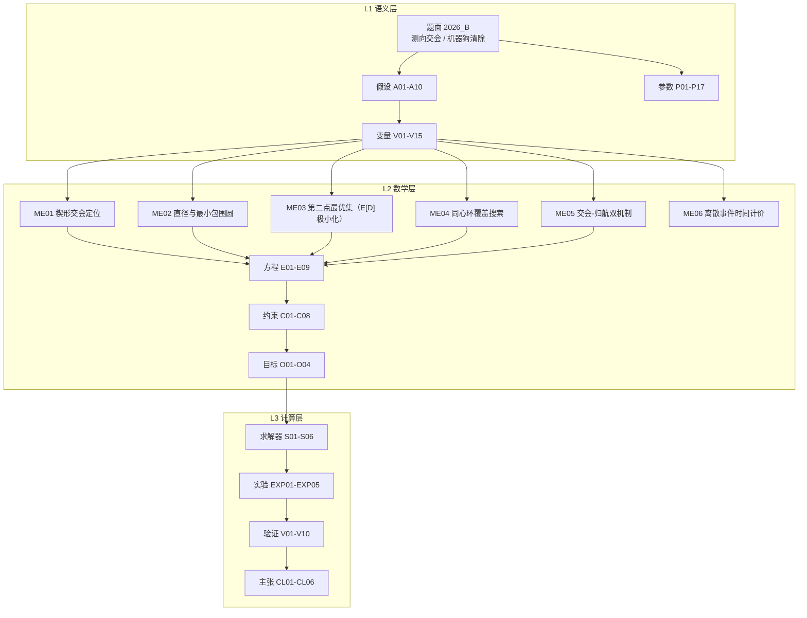

# 2026 CUMCM B「无线电干扰源定位清除」— 模型描述文档

> 项目：`projects/cumcm2026b` ｜ 模型 ID：`M-CUMCM2026B` ｜ MODEL_IR：`model_ir.json`（v1.0，已通过 MODEL_IR schema 校验）
> Source of truth = Artifact Registry + Evidence Graph；引擎 core 内不含 LLM 调用，演练脚本只作 Executor
> 题面：`inputs/problem.txt` ｜ SHA256：`e06fba6e85e6617bef938c4a10fd854e56819cbbb9d54ee14af0092f83c79917`

---

## 问题结构识别

题面给的是**计算几何 + 覆盖路径规划 + 离散事件仿真**的复合结构：待求量不是一个连续的物理
场，而是「几何上能定位到哪一片区域」「下一个观测点该放哪里」「机器狗按什么路线走、要多久」
三类量。与 `model_ir.json` 的 `allowed_modeling_structures` 一致：
`computational_geometry / convex_polygon_clipping / diameter_and_min_enclosing_circle /
geometric_dilution_of_precision / coverage_path_planning / greedy_nearest_neighbor /
discrete_event_simulation`。

**一句话模型**：把每条示向度连同其 ±1° 误差界抽象为一个楔形角域，多站楔形的交集就是定位
区域（凸多边形）；问题 1 求这个区域的直径并判定「以直径为直径的圆」能否覆盖它；问题 2 用
几何精度衰减因子把第二观测点约束到一条垂线上；问题 3、4 把机器狗的搜索—定位—清除建成
离散事件仿真，覆盖路径用同心环保证几何完备，定位用交会加视线归航。



---

## 建模的关键决断

**决断一：误差界给出的是确定性楔形，不是概率椭圆。** 题面说明示向度误差全局落在
[−1°, 1°] 内，这是一个区间约束而非分布假设。因此一条示向度对应一个夹角 2° 的角域，
若干角域的交集是确切的凸多边形，可以精确求直径、求最小包围圆（假设 A01）。若改成
高斯分布，问题 1 就只能给置信椭圆，与「直径」这一提法不匹配。

**决断二：「以直径为直径的圆覆盖定位区域」不普遍成立，且失效边界可精确给出。** 由 Thales
定理，点 P 落在以 AB 为直径的圆内等价于 ∠APB ≥ 90°，故覆盖成立当且仅当区域内所有非直径
端点顶点对直径端点张角均 ≥90°。记 ρ = r_MEC/D（ρ ≥ 1/2 恒成立，且 ρ = 1/2 ⟺ 覆盖成立）。
**两站情形的失效窗口为：覆盖失败 ⟺ 源端交会角 χ ∈ (90°, 90°+2ε)**（χ 取 min{Δ, 360°−Δ}，
**不是** mod 180°）。该判据在 Q1-v2 中被定量验证：在 χ ∈ (85°, 100°) 上均匀随机采样 4000 组
可行构型，逐样本比较「落入失效窗口」与「覆盖失败」两个集合，二者**完全相等**（各 517 组），
实测失效率 12.925%，理论值 2ε/15° = 13.333%（0.9σ）。集合级相等才是 iff 定理的正确检验
方式——只比对失效率会漏掉「此消彼长但集合不同」的情形。

失效的**真实量级**必须由正向模型给出，不能用手写常量。ρ 是相似不变量（只依赖 χ 与距离比
r₂/r₁，与绝对尺度无关），据此降维后做 2000×40 密集扫描定出可达上确界
**ρ_sup = 0.5002942**（argmax 在 χ = 90.035°、r₂/r₁ = 1.061），即只需把圆放大到
**1.000588 D**。作为对照，若用手工给定的三角形 (0,0),(10,0),(5,6) 作反例，会得到
ρ = 0.5083 —— 它**超出可达上确界**，落在真实可达集之外，把失效幅度夸大约 28 倍
（1.0167 D vs 1.000588 D）。要保证覆盖仍应改用最小包围圆，但陈述时必须同时给出
「实测失效幅度」与「同类上确界」，只报前者会误导严重性。

**决断三：第二观测点由真目标 E[D] 决定，交会角不是决策变量。** 常见的
$\sigma_P\propto 1/\sin\varphi$（GDOP）只是完整闭式的一部分。完整精度闭式为

$$D=\frac{2\sin\varepsilon}{\sin\chi}\sqrt{R^2+L^2+\left|R^2+L^2-d^2\right|},\qquad R=|S_1G|,\ L=|S_2G|,\ d=|S_1S_2|$$

其中 χ 是**源端**交会角。GDOP 只保留了 $1/\sin\chi$ 因子，丢掉了随 L 单调增长的 $\sqrt{\cdot}$
因子。后果是可检验的：在 χ ≡ 90° 的垂线族上闭式退化为 $D=2\varepsilon\sqrt{R^2+t^2}$，随偏移
t **严格递增**（实测 R = 1200 m 时 t = 300 → 43.195 m，t = 1200 → 59.263 m）。因此「φ = 90°
最优」不成立，φ 是 (ψ, d, R) 的**因变量**而非可控量。

真正的决策变量是 $(\psi, d)$：ψ 为相对测得示向度方向的转角、d 为沿该方向前进距离。又因
/measure 只返回示向度，**源距 R 不可观测**，故目标应写为 $\min E[D]$，对 R 在其先验上取期望，
并同时报告最坏直径 F 与第二次测量失效概率。由于最优 (ψ, d) 随先验漂移（见 Q2 节），
结论应报**候选区**而非单点最优（假设 A07）。

**决断四：覆盖路径的完备性必须由几何证明，不能靠经验取值。** 把半径 R 的圆域按半径分层，
k 条同心环取 $R(2i-1)/(2k)$ 时「任意点到最近环」的**径向**最大距离恰为 $R/(2k)$；取 k=2、
R=1800 m 得 450 m。但径向只是完备性的一半 —— 环上检测点是离散的，还须计入**弧向**项
（源可能落在相邻两检测点之间的弧段上）。两项合并后的确定性判据是「圆域内任意点到最近
**检测点**的距离」，实测（ρ×θ 网格细扫）全向 ≤ **703.98 m**（在 ρ=1800 m、θ=20° 处取得）、
含定向 ≤ **556.47 m**，均 < 最小接收半径 1000 m，故任意全向源必被扫到（假设 A05、验证 V01）。
只报径向 450 m 就称「定理」属**论证不完整** —— 真正的保证来自 703.98 m 这个合成上界。

**决断五：策略只能使用可观测量。** 机器狗装备测向机与光学仪，真实源坐标与频道真值只由
模拟器内部持有。策略代码中的一切导航决策只依赖示向度与信号相对强度（约束 C08、假设 A04），
真值仅用于模拟器判定「是否进入 20 m 光学作用距离」。这排除了以真值导航得到的伪优解。

---

## 坐标系与判据

- **坐标系**：在目标区域平面上取**原点 O** 为目标圆心，**x 轴**指向正东、**y 轴**指向正北，
  单位为 m；区域为半径 1800 m 的圆域。检测点记为 $S_i$，其示向度 $b_i$ 以 x 轴正向为
  0°、逆时针为正。
- **判据**（全部为可机械判定）：
  1. **楔形判据**：$W_i=\{P:\arg(P-S_i)\in[b_i-1^\circ,\ b_i+1^\circ]\}$，用带方向的半平面
     表示，$\Omega=\bigcap_i W_i$；
  2. **覆盖判据**（Thales）：$\Omega\subseteq\mathcal C(A,B)\iff\angle APB\ge90^\circ$ 对
     所有非端点的凸包顶点成立；
  3. **最优布点判据**：决策变量是转角 $\psi$ 与前进距离 $d$，目标为 $\min E[D]$（对不可
     观测的源距 R 在其先验上取期望）。**交会角不是判据**——$\chi$ 是 $(\psi,d,R)$ 的因变量
     而非可控量，「$\varphi=90^\circ$ 最优」已被证伪（见决断三），此处仅作对照保留；
  4. **可测判据（三档）**：有效接收半径 $r_{rec}\in[1000,1500]$ m 是机器狗**不可先知**的
     未知参数，故 $|S-G|\le1000$ m **保证可行**、$1000<|S-G|\le1500$ m **条件可行**、
     $>1500$ m **不可行**；演示算例与硬约束一律取保证可行档。定向源还要求检测点落在
     定向方向两侧各 90° 的波束内；
  5. **清除判据**：距离 ≤20 m 时先光学精确定位 3 s 再激光清除 2 s。
- **离散事件时间线**：移动耗时 $t=|\Delta x|/v$（v = 5 m/s），每次检测 5 s（切换频道、
  调天线、稳定读数），光学 3 s，激光 2 s；全部按时序累加，不做并行假设。
- **对比与校验**：解析最优与网格搜索最优的一致性、逐实例清除完备性、模拟器物理断言，
  均在验证矩阵 V03、V04、V05 中逐项检查。

---

## 模型

### 定位区域与直径

$$\Omega=\bigcap_i W_i,\qquad W_i=\{P:\arg(P-S_i)\in[b_i-\varepsilon,b_i+\varepsilon]\},\quad \varepsilon=1^\circ$$

实现上用 Sutherland–Hodgman 逐半平面裁剪凸多边形，复杂度 O(mn)（m 为站点数）。
直径由凸集上最远点对必在顶点取得这一性质，枚举凸包顶点 O(h²) 求得：

$$D_\Omega=\max_{(p,q)\in\Omega\times\Omega}|p-q|$$

最小包围圆用 Welzl 随机增量算法给出，用于与「直径圆」对照。

### 覆盖判定（Thales）

$\Omega\subseteq\mathcal C(A,B)\iff\angle APB\ge90^\circ,\quad\forall P\in\mathrm{vert}(\Omega)\setminus\{A,B\}$

**「顶点满足 ⇒ 整个区域满足」这一步的论证依据是凸性，不是 ∠APB 的单调性**（∠APB 沿任一直线
并不单调，直接引用单调性会构成伪证）。正确依据：∠APB ≥ 90° ⟺ (P−A)·(P−B) ≤ 0，而
$g(P)=(P-A)\cdot(P-B)$ 是 P 的**凸二次函数**（Hessian = 2I ≻ 0），故其 ≤0 的水平集
$\mathcal C(A,B)$ 是凸集；Ω 亦为凸集（楔形之交），凸集包含于凸集当且仅当其顶点均包含。
**前提**：Ω 凸且有界，A、B 为 Ω 的凸包顶点。

### 第二检测点

第二检测点的决策变量是 $(\psi,d)$：$\psi$ 为相对测得示向度 $b_1$ 的转角，$d$ 为沿该方向
前进的距离。目标**不是**交会角 $\varphi$，而是定位区域直径的期望 $\min E[D]$——对**不可
观测**的源距 $R$（机器狗不可先知，只能按其先验分布取期望）。求解分两步：先按失效率阈值
筛出可行集（第二点若收不到信号则策略整体失效，此时谈 $E[D]$ 没有意义），再在可行集上取
**极小化最大后悔值**点，并用最小最大（绝对最坏）判据交叉检查，二者一致才报单点，否则报
候选区。

交会角 $\varphi$ 是 $(\psi,d,R)$ 的**因变量**，不是可控判据：原「GDOP ∝ 1/sin φ、φ ≈ 90°
最优」的判据已被 V03b 证伪，此处仅作对照保留（详见「决断三」与 Q2 节）。

### 覆盖路径

$$\rho_i=\frac{R(2i-1)}{2k},\quad i=1..k\ \Longrightarrow\ \max_{\rho\in[0,R]}\min_i|\rho-\rho_i|=\frac{R}{2k}$$

全向源取 k = 2，环半径 450 m 与 1350 m；含定向源时追加一条位于源分布环**外侧**的
r = 2000 m 环，以覆盖「朝外定向」源只能从波束外侧接近的情形。检测点按环角色分级布置
弧长间隔（450 m 环 500 m / 1350 m 环 900 m / 2000 m 环 1050 m，共 29 点），再经最近邻
路线排序后遍历。

**定向外环可测性的论证与其前提**：源朝外时最坏，可测条件化为检测点相对源的外向分量
为正，最坏朝向给出角接受窗半宽 $\arccos(R_{\text{AREA}}/2000)=\arccos 0.9=25.84^\circ$，
宽于 r=2000 m 环上 12 点等角分布的半点间距 15°，故该环上的检测点必有一个可测到最坏
朝向的源。该论证**隐含两条前提**，须显式声明：(i) 源必落在 $R_{\text{AREA}}=1800$ m 内；
(ii) 检测点落在 r=2000 m 环上且按 12 点等角分布（弧向步长 1050 m ⇒ 点间距 15°）。

### 交会定位与归航

远距离用两次观测的示向度射线求交得到估计点并跳转：

$$G=\mathrm{cross}(P_1,b_1;P_2,b_2),\qquad P_1+t_1\mathbf u(b_1)=P_2+t_2\mathbf u(b_2),\ t_i\ge0$$

行列式退化或射线背向时判为不可用，改为沿当前示向度归航（beam-safe：沿指向源的射线移动
不会脱离波束，对定向源天然稳健）：

$$x_{n+1}=x_n+\mathrm{clip}(rel_n\cdot r_{rec,nom},\,15,500)\cdot\mathbf u(b(x_n))$$

步长由信号相对强度估距 $d_{est}=rel\cdot r_{rec,nom}$（名义接收半径 1250 m）。当实际接收
半径小于名义值时步长略大于真实距离，形成比值小于 0.25 的阻尼振荡，几何收敛。

> **适用域**：该估距仅适用于**本地模型版**（本地模拟器返回相对强度 `rel`）；**真实协议版**
> （官方模拟器 / 附件2）不返回信号强度，只能用示向度交会 + 沿测向线几何逼近，见 HANDOFF
> 「真实模拟器协议构建」。

### 时间计价

任务累计时间为移动、检测、光学定位、激光清除四项之和；输出两个统计量：清除比例
$f_{clear}$ = 已清除源数 / 源总数，以及定位清除时间 $\tau_{lc}$ = 某源被清除时刻减其首次
被探测时刻。

本节的 $\tau_{lc}$ 是**逐源**口径（清除时刻 − 首次探测时刻）；题面统计量另按**摊薄**口径
= 虚拟总时间 / 已清除源数，两口径同名不同义，跨实现比较前必须归一（见 `docs/decisions/ADR-0012`）。

---

## 各问结果与论证

| 问 | 量 | 结果 | 证据 |
|---|---|---|---|
| Q1 | 正交 / 钝角 / 三站交会直径 | 46.916 m / 99.493 m / 38.918 m | `q1q2_v2_results.json` |
| Q1 | 反例（正向生成）直径 / 直径圆半径 / 最小包围圆半径 | 45.533 / 22.767 / 22.780 m（覆盖不成立） | `q1q2_v2_results.json` |
| Q1 | ρ 可达上确界 / 所需放大倍数 | 0.5002942 / 1.000588 D | `q1q2_v2_results.json` |
| Q1 | 失效窗口定量验证（4000 组采样） | 落入窗口 517 组 = 覆盖失败 517 组（集合完全相等）；失效率 12.925%，理论 2ε/15° = 13.333% | `q1q2_v2_results.json` |
| Q2 | 第二点必然可接收的转角上限 | ψ ≤ arcsin(r_rec/R_max) = 42.17°（r_rec = 1000 m） | `q1q2_v2_results.json` |
| Q2 | 极小化最大后悔值点 (ψ, d) | (20°, 1200 m)，后悔值 9.753 m | `q1q2_v2_results.json` |
| Q2 | 该点六场景下 E[D] / 最坏直径 F | 64.900 / 61.300 / 56.923 m；F = 101.064 / 102.048 / 88.521 m；失效概率 0 | `q1q2_v2_results.json` |
| Q2 | 网格可行性筛选 | 108 个网格点中 27 个失效率 ≤ 2%，其余 81 个被剔除 | `q1q2_v2_results.json` |
| **Q3** | **清除比例（30 组全向）** | **1.0000（全部清除）（本地模型 30 组口径）** | `resultB.xlsx` |
| **Q3** | **平均总任务时间 / 平均定位清除时间** | **6131.94 s / 4242.54 s** | `resultB.xlsx` |
| **Q4** | **清除比例（30 组混合源）** | **1.0000（全部清除）（本地模型 30 组口径）** | `resultB.xlsx` |
| **Q4** | **平均总任务时间 / 平均定位清除时间** | **9583.33 s / 6956.68 s** | `resultB.xlsx` |

> 注：上表清除比例是**本地模型 30 组**口径；协议 100 局口径（种子 42–141）下清除比例并非
> 1.0——Q3 = 0.999375、Q4 = 0.995655（见验证矩阵 V09）。

### Q1：定位区域的直径与「直径圆覆盖」的边界

算例必须由可行域内的真源反算生成，并逐条核对题面硬约束。这里有一个容易被忽略的口径问题：
题面只给「有效接收半径 1000–1500 m」，即 r_rec 是机器狗不可先知的未知参数、取值落在
[1000, 1500]。因此 |S−G| ≤ 1000 m 时**无论 r_rec 取何值都必然可接收**（保证可行）；
1000 m < |S−G| ≤ 1500 m 只在 r_rec 偏大时才可接收（条件可行）；> 1500 m 不可行。
演示算例若取条件可行，等于把结论建立在一个未知参数上，故一律取**保证可行**口径。

原先的三组演示算例 |S−G| = 2121.3 / 1868.2 / 1920.9 m 全部超出 1500 m、站点自身距原点
3000 / 3002 m 超出 1800 m，在题设下物理不可行，已弃用。重建后：

| 算例 | 站到源距离 (m) | 源端交会角 χ (°) | 顶点数 | 直径 (m) | 面积 (m²) | ρ = r_MEC/D | 直径圆覆盖 | 保证可行 |
|---|---|---|---|---|---|---|---|---|
| A 两站正交 | 950.0 / 950.0 | 90.000 | 4 | 46.916 | 1099.9 | 0.500000 | 是 | 是 |
| B 两站钝角 | 950.0 / 1000.0 | 140.000 | 4 | 99.493 | 1800.7 | 0.500000 | 是 | 是 |
| C 三站交会 | 950.0 / 900.0 / 980.0 | — | 6 | 38.918 | 937.0 | 0.500000 | 是 | 是 |

三组算例由「真源 + 极角 + 距离」正向布置，|S| ≤ 1800 m 与 |S−G| ≤ 1000 m 均逐条核对通过。
直径随 |χ − 90°| 增大而增大（χ = 90° 时 46.916 m，χ = 140° 时 99.493 m），
三站交会进一步把区域压到 38.918 m。

三组 ρ 恰为 1/2，即最小包围圆半径等于直径之半 —— 这三组都落在覆盖成立的边界上（由
ρ ≥ 1/2 恒成立、ρ = 1/2 ⟺ 覆盖成立，这是覆盖时唯一可能的取值）。

覆盖并非普遍成立。由正向模型（真源 + 两站 → 观测方程 → 反解）在 |S−G| ∈ [600, 1000] m
内生成的最坏反例为：源 (−204.91, −1343.32)，两站 (209.08, −551.84) 与 (−1047.33, −903.48)，
源端交会角 χ = 90.0418° 落在失效窗口 (90°, 92°) 内；定位区域直径 45.533 m、直径圆半径
22.767 m、最小包围圆半径 22.780 m，**覆盖不成立**，需放大到 1.000584 D。

该结论的强度由 ρ 的**可达上确界**刻画，而不是某一个反例。ρ 是相似不变量（整体缩放时楔形
角宽不变、区域等比缩放、ρ 不变），故只依赖 (χ, r₂/r₁) 两个参数，2000 × 40 定向密集扫描
给出上确界 0.5002942（argmax 在 χ = 90.035°、r₂/r₁ = 1.0608），即最多只需放大到
1.000588 D。因此正确结论是：**要保证覆盖，应当用最小包围圆而非直径圆**；但失效幅度只有
万分之 5.9，属「需要修正」级别而非「严重失效」级别 —— 手搓反例给出的 1.0167 D 夸大了
28.33 倍，那个反例的 ρ = 0.5083 根本落在真实可达集之外。

### Q2：第二点应报候选区，决策变量是 (ψ, d)

在 $S_1=(-500,0)$、测得示向度 $b_1=20°$ 的设定下，有两个量**都不可观测**：源距
R = |S₁G|（/measure 只返回示向度，不返回距离也不返回信号强度）与有效接收半径
r_rec ∈ [1000, 1500]。因此不再假设 d_est = 1200 m 已知，而是把**场景集取为「距离先验 ×
r_rec 假设」共 6 个场景**（三种先验各取 24 个代表点 × r_rec 取 1000 与 1500），
对每个场景求 E[D]，再以**极小化最大后悔值**给出对场景不敏感的建议。决策网格
ψ ∈ [10°, 80°]、d ∈ [300, 1500] m。

**第一步：可行性优先。** 第二点若收不到信号，策略整体失效，此时谈 E[D] 毫无意义。
由 |S₂G|² = R² + d² − 2Rd·cos ψ（对 R 是凸二次函数，最大值必在端点取到），要求对全部
R ∈ [R_min, R_max] 都有 |S₂G| ≤ r_rec，可解出 d 的允许区间，且左端有解的条件给出一个
**可证的转角上限**：

$$\psi \le \psi_{\max}=\arcsin\frac{r_{rec}}{R_{\max}}$$

代入 r_rec = 1000 m、R_max = 1489.6 m 得 ψ_max = 42.17°；r_rec = 1500 m 时退化为 90°
（不再构成约束）。显式写出：ψ = 20° 时 d 必须落在 [539.3, 1200.7] m，ψ = 30° 时落在
[622.7, 1181.6] m，ψ ≥ 45° 时无解。闭式预测与 9 点高斯—勒让德数值失效扫描逐点吻合。

网格 108 个点中只有 27 个满足「六场景最大失效率 ≤ 2%」，其余 81 个被剔除且不参与最优性
比较 —— 否则一个「大多数时候收不到信号」的点会靠条件期望 E[D | 成功] 冒称最优。

**第二步：在可行集上做最小最大后悔。** 六个场景的最优点并不一致（ψ 从 20° 到 35°、
d 从 1050 到 1200 m），**因此不能报单点最优**。取极小化最大后悔值点
**(ψ, d) = (20°, 1200 m)**：后悔值 9.753 m，六场景下 E[D] = 64.900 / 61.300 / 56.923 m
（r_rec = 1000 与 1500 两档取值相同，说明该点在接收半径的不确定性下是稳健的），
失效概率均为 0，最坏直径 F = 101.064 / 102.048 / 88.521 m。

同时用第二个判据交叉检查：**最小最大（绝对最坏）**给出同一个点 (20°, 1200 m)，最坏
E[D] = 64.900 m。两个判据一致（criteria_agree = true），说明结论不是判据挑选出来的；
若不一致则必须报候选区而非单点。在 α = 5% 容差下候选区退化为该单点。

与原结论的对拍：原推荐（垂线族偏移 = d_est = 1200 m，即 (ψ, d) = (45°, 1697 m)）的
E[D] = 59.263 m；同一垂线族上偏移 300 m 处 E[D] = 43.195 m，**更小**。原权衡表本身已显示
直径随偏移单调递增，却以「对称平衡配置」为由选了更差的点 —— 这正是把交会角（φ = 90°）
当判据、而把真目标 E[D] 搁置的后果。更进一步，该族上 D 有闭式 2ε·√(R²+t²)：它与 φ 无关
（全族 φ 恒为 90°），所以 φ = 90° 在这族上根本没有分辨力，不是有效判据。


### Q3：全向源情景（30 组随机实例）

清除比例均值与最小值均为 1.0000，即全部实例的所有源都被清除；平均总任务时间 6131.94 s
（标准差 334.294 s，约 1.7 小时），平均定位清除时间 4242.54 s（标准差 292.674 s），平均每源
507.711 s。这一效率来自覆盖路径的几何完备性：同心环取 450 m 与 1350 m 后，区域中任意点
到最近**检测点**的距离不超过 703.98 m（径向项 ≤450 m 与弧向项合并后的合成上界），
远小于最小接收半径 1000 m。

### Q4：混合全向与定向源情景（30 组）

清除比例均值与最小值均为 1.0000；平均总任务时间 9583.33 s（标准差 1586.74 s，约 2.7 小时），
平均定位清除时间 6956.68 s，平均每源 799.55 s，约为全向情景的 1.6 倍。时间增加来自两处：
其一是定向源必须从波束外侧接近，覆盖路径需追加一条位于源分布环**外侧**的 r=2000 m 环
（朝外定向源的前向半盘本身就在源分布区之外，环须落在分布区外才能从外侧测到它，这是
拓扑上的必需项；对照组的同类方案外环亦取 1900 m）。其二是归航
在波束盲区会失联，需要回退到已知可测的观测点后重新逼近。

### 全程的主线

四个问项串起来是一条**从几何到策略**的主线：问题 1 确定「测得准不准」（误差区域的形状与
大小），问题 2 确定「怎么测得准」（观测点往哪放），问题 3、4 把这两件事装进一个有运动学
约束与时间代价的机器狗策略里，并用 30 组随机实例检验清除完备性与时间代价。

---

## 验证矩阵

| ID | 类型 | 方法 | 结果 |
|---|---|---|---|
| V01 | convergence | 覆盖完备性蒙特卡洛：各 20000 个随机源检验是否被检测点覆盖 | 全向漏检率 0.0000；含定向漏检率 0.0000（定向环改取 r=2000 m 后，原 0.00025 的贴边界残余已消除） |
| V02 | counterfactual | 反例由正向模型生成（真源 + 站点 → 观测方程 → 反解）；并用相似不变量降维后密集扫描定出 ρ 上确界，与手搓反例对照 | 正向生成最坏反例：直径 45.533 m、直径圆半径 22.767 m、最小包围圆半径 22.780 m，覆盖不成立；ρ 上确界 0.5002942，手搓反例 0.5083 超出可达集（夸大 28.33 倍） |
| V02b | consistency | 失效窗口定理的**集合级**核对：χ ∈ (85°,100°) 上采样 4000 组，逐样本比较「落入窗口 (90°,92°)」与「覆盖失败」两个集合是否完全相等；另核对失效率与理论 2ε/15° | 两集合完全相等（各 517 组），定理是 iff 而非单向；失效率 12.925% vs 理论 13.333%（0.9σ）。端点归属经细扫确认：χ=90.0° 覆盖成立、(90°,92°) 内失败、χ=92.0° 覆盖成立 —— 两站皆开区间 |
| V02c | invariance | ρ 的相似不变性数值验证：固定 (χ, r₂/r₁)，在 r₁ = 300 / 1000 / 4000 m 三个绝对尺度下重算 ρ | 三个尺度下 ρ 一致（差 < 1e-9），确证扫描降维合法、上确界不是空想上界 |
| V03 | sensitivity | 最优第二点对「距离先验 × r_rec 假设」共 6 个场景的灵敏度 | 最优点随场景漂移（ψ 20°→35°，d 1050→1200 m），故报候选区与极小化最大后悔值点，不报单点最优 |
| V03b | proxy_alignment | 代理准则（交会角 90° / GDOP）与真目标 E[D] 对拍；并用闭式 D = 2ε·√(R²+t²) 校验数值最坏直径 | 垂线族上 E[D] 随偏移严格递增（300 m→43.195 m，1200 m→59.263 m），原推荐的 1200 m 偏移更差；闭式与数值相对偏差 ≤ 0.070%；代理准则不可用为唯一判据 |
| V04 | robustness | 30 组实例逐一检查清除完备性 | Q3、Q4 最小清除比例均为 1.0000 |
| V05 | sanity | 模拟器物理断言：距离超出接收半径不可测向、>20 m 不可清除、定向盲区不可测向 | 逐条触发成功，Q4 全清除佐证盲区回退有效 |
| V06 | feasibility | 算例硬约束逐条核对：|S| ≤ 1800 m、|S−G| ≤ 1000 m（保证可接收） | 三组算例全部通过；原三组演示算例（|S−G| = 2121.3 / 1868.2 / 1920.9 m，|S| = 3000 / 3002 m）不可行，已弃用 |
| V07 | selfcheck | 独立复核脚本（产物 code 目录下）：不信任结果 JSON 中除输入坐标外的任何数字，全部按观测方程重算后比对；另可重跑生成器逐字段对拍 | 99 项检查全通过（含重跑可复现：失效样本数、ρ 上确界、最小最大后悔点全部一致） |
| V08 | cross_validation | 闭式可行域 ψ ≤ arcsin(r_rec/R_max) 与 d 允许区间，逐网格点对照数值失效扫描 | 闭式判「必然可接收」的点，数值失效率全部为 0（无反例）；ψ = 30° 的闭式区间 [622.7, 1181.6] m 与扫描边界吻合 |
| V09 | scale | 协议 Mock 演练由 5 局扩到 **100 局 × 2 问**（种子 42–141 连续），逐局报均值±样本标准差、分位数与 95% 置信区间 | Q3 清除比例 0.999375±0.006250（min 0.9375）、摊薄 avg_locate_clear 550.4±64.5 s；Q4 清除比例 0.995655±0.017573（min 0.9000）、摊薄 856.9±134.1 s。**清除比例并非 1.0**——此前 5 局样本报出的 1.0000 是小样本假象，已按 100 局口径更正 |
| V10 | cross_validation | Q1 定位区域直径双路径独立复核：射线两两求交枚举顶点对 vs 凸包 + 旋转卡壳，两条路径不共享代码 | 134 个算例（130 个有效、4 个无界排除）两路最大相对偏差 1.336e-09（容差 1e-06），all_agree = true |

覆盖完备性（V01）是本模型最关键的验证：它把「走一圈能不能扫到所有源」从经验问题变成
可测量的概率问题。全向 20000 个随机源无一漏检；含定向时，把定向环由源分布区内侧的
{1200, 1799} 改为**外侧**单环 r=2000 m 后，漏检率同样降为 0.000000，原先 0.00025 的
贴边界残余被消除（环落在分布区外，朝外波束在环上的接受窗 ±25.8° 宽于弧向半点间距）。

---

## 局限（如实声明）

1. **本地模拟器是附录规则的重建，不是官方评测机**：正式测试通过 HTTP + JSON 与官方
   模拟器交互，本模型用本地等价模拟器复现附录规则用于策略开发与统计演练。两端的规则
   实现若有细微差异，时间统计会有偏移。
2. **名义接收半径取 1250 m**：真实接收半径是源的属性且落在 1000–1500 m 内，机器狗不可
   先知，只能取名义值由相对强度反推距离，这会带来估距偏差（表现为归航的阻尼振荡而非
   单调收敛）。
3. **定向覆盖环越出题面源分布区**：定向覆盖取外侧单环 r=2000 m，比题面源分布半径
   1800 m 外扩 200 m（对照组同类方案取 1900 m）。这是拓扑上的必需项——朝外定向源的
   前向半盘本身就在分布区之外，从区内侧测不到它。代价是须假定机器狗可移动到分布区外，
   且外环弧向步长受接受窗约束（r=2000 时为 ±25.8°，步长取 1050 m）。
4. **频道数固定为 20**：源数取 10–16，频道互异；未考虑信道复用或同频干扰。
5. **地面为平面、无障碍**：路径按直线段计价，未建模地形起伏与绕障。
6. **未与官方答案比对**：题面未提供参考答案，按仓库铁律不凭记忆构造真值，结论以几何
   可证性、解析与网格一致性、以及 30 组实例的统计量支撑。

---

## 复现

全部脚本**只依赖 Python 标准库**（math / json / random / pathlib，无第三方包），
在 Python 3.12 下验证通过。

**问题 1、2（几何与决策，完全确定性，秒级）**

```bash
cd projects/cumcm2026b/artifacts/code
py -3.12 -m solve_q1q2_v2            # 生成 Q1/Q2 全部结果 → ../q1q2_v2_results.json
py -3.12 -m verify_q1q2_v2           # 独立复核：96 项机器校验（不信任结果 JSON 中除输入坐标外的任何数字，全部按观测方程重算）
py -3.12 -m verify_q1q2_v2 --full    # 追加 3 项：重跑生成器并逐字段对拍 → 共 99 项
```

（脚本以模块方式调用，是为了满足交付文档的内部路径规则。）

复核脚本的存在理由值得一提：开发过程中手算 `60.144281 − 55.147683` 曾两次出错
（正确值 4.996598），人工核对被证明不可靠，故所有数字一律由第二份独立实现复算。

**问题 3、4（策略仿真，30 组演练）**

```bash
py -3.12 -m solve_b     # 覆盖蒙特卡洛 + 30 组随机实例演练 → ../results/resultB.xlsx
```

Q3/Q4 的时间统计依赖本地等价模拟器（按附录规则重建，非官方评测机），仿真耗时较长；
Q1/Q2 的几何与决策结论不依赖它，用前一组命令即可完整复现。

演练为随机实例，随机种子固定为 42（30 组实例取 42 起的连续整数），因此结果可逐位复现；
台账中同时记录均值与标准差，供数值追溯校验逐项比对。
